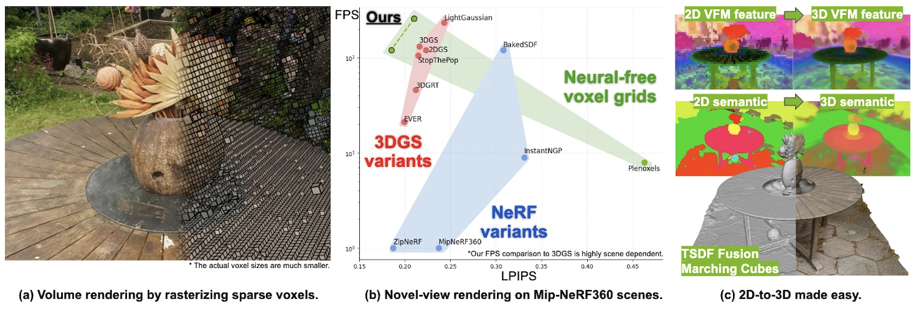
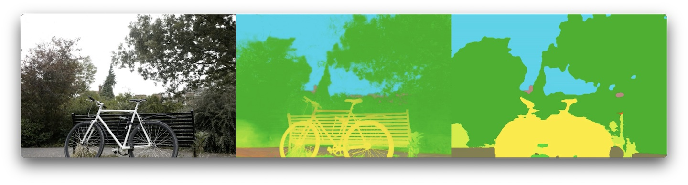
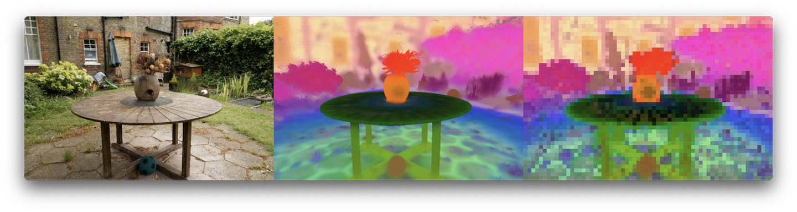

# Sparse Voxels Rasterizer



### [Project page](https://svraster.github.io) | [Paper](https://svraster.github.io/SVRaster.pdf) | [Paper (small)](https://svraster.github.io/SVRaster_small.pdf) | [jupyter notebooks](./notebooks/)

<details>
<summary>Paper abstract</summary>
We propose an efficient radiance field rendering algorithm that incorporates a rasterization process on adaptive sparse voxels without neural networks or 3D Gaussians. There are two key contributions coupled with the proposed system. The first is to adaptively and explicitly allocate sparse voxels to different levels of detail within scenes, faithfully reproducing scene details with 65536^3 grid resolution while achieving high rendering frame rates. Second, we customize a rasterizer for efficient adaptive sparse voxels rendering. We render voxels in the correct depth order by using ray direction-dependent Morton ordering, which avoids the well-known popping artifact found in Gaussian splatting. Our method improves the previous neural-free voxel model by over 4db PSNR and more than 10x FPS speedup, achieving state-of-the-art comparable novel-view synthesis results. Additionally, our voxel representation is seamlessly compatible with grid-based 3D processing techniques such as Volume Fusion, Voxel Pooling, and Marching Cubes, enabling a wide range of future extensions and applications.
</details>


## Install
1. Install Pytorch first. The tested versions are `1.13.1+cu117` and `2.5.0+cu124`.
2. May need to install cuda-toolkit for your virtual environment that is aligned with the installed pytorch:
    - `conda install -y -c "nvidia/label/cuda-11.7.0" cuda-toolkit`
    - `conda install -y -c "nvidia/label/cuda-12.4.0" cuda-toolkit`
3. `pip install -r requirements.txt` for other packages.
4. `pip install -e cuda/` for sparse voxel CUDA rasterizer and some utilities.


## Reconstructing your own capture
Below go through the workflow for reconstruction from a scene capturing. Check [example.ipynb](./notebooks/example.ipynb) for an actual example.

### Data preparation
We recommend to follow [InstantNGP](https://github.com/NVlabs/instant-ngp/blob/master/docs/nerf_dataset_tips.md#colmap) video or images processing steps to extract camera parameters using COLMAP. [NerfStudio](https://docs.nerf.studio/quickstart/custom_dataset.html) also works.

We now only support pinhole camera mode. Please preprocess with `--colmap_camera_model PINHOLE` of InstantNGP script or `--camera-type pinhole` of NerfStudio script.

### Scene optimization
```bash
python train.py --eval --source_path $DATA_PATH --model_path $OUTPUT_PATH
```
All the results will be saved into the specified `$OUTPUT_PATH` including the following results:
- `config.yaml`: The config file for reproduction.
- `pg_view/`: Visualization of the training progress. Useful for debugging.
- `test_stat/`: Some statistic during the training.
- `test_view/`: Some visualization during the training.

The configuration is defined by the following three, the later overwrites the former.
- `src/config.py`: Define the configuable setup and their initial values.
- `--cfg_files`: Sepcify a list of config files, the later overwrites the former. Some examples are under `cfg/`.
- command line: Any field defined in `src/config.py` can be overwritten through command line. For instances: `--data_device cpu`, `--subdivide_save_gpu`.

Like InstantNGP and other NeRF variants, defining a proper main scene bounding box is crucial to quality and processing time. Note that the main scene bound is defined for the main 3D region of interest. There are another `--outside_level` (default 5) Octree levels for the background region. The default main scene bound heuristic may work well in many cases but you can manually tweak them for a better results or covering new type of capturing trajectory:
- `--bound_mode`:
    - `default`
        - Use the suggested bbox if given by dataset. Otherwise, it automatically chose from `forward` or `camera_median` modes.
    - `camera_median`
        - Set camera centroid as world origin. The bbox radius is set to the median distance between origin and cameras.
    - `camera_max`
        - Set camera centroid as world origin. The bbox radius is set to the maximum distance between origin and cameras.
    - `forward`
        - Assume [LLFF](https://github.com/Fyusion/LLFF?tab=readme-ov-file#local-light-field-fusion) forward-facing capturing. See `src/utils/bounding_utils.py` for detail heuristic.
    - `pcd`
        - Use COLMAP sparse points to compute a scene bound. See `src/utils/bounding_utils.py` for detail heuristic.
- `--bound_scale`: scaling the main scene bound (default 1).

For scenes with background masked out, use `--white_background` or `--black_background` to specify the background color.

Other hyperparameter suggestions:
- `--lambda_normal_dmean 0.001 --lambda_normal_dmed 0.001` for a better geometry.
- `--lambda_T_inside 0.01` to encourage rays to stop inside the Octree. Useful for real-world scenes.
- `--lambda_T_concen 0.1` to encourage transmittance to be either 0 or 1. Useful for object centric scenes with background masked out.
- `--lambda_sparse_depth 0.01` to use sparse depth loss from COLMAP points. It's helpful for regions with less observed angles.
- `--save_quantized` to apply 8 bits quantization to the saved checkpoints. It typically reduce ~70% model size with minor quality difference.

### Measuring FPS
```bash
python render.py $OUTPUT_PATH --eval_fps
```

### Rendering views
- Rendering full training views:
    - `python render.py $OUTPUT_PATH --skip_test --rgb_only --use_jpg`
- Rendering testing views and evaluating results:
    - It only works when training with `--eval`.
    - `python render.py $OUTPUT_PATH --skip_train`
    - `python eval.py $OUTPUT_PATH`
- Render fly-through video:
    - `python render_fly_through.py $OUTPUT_PATH`

### Interactive viewer
```bash
python viz.py $OUTPUT_PATH
```
You can then navigate the trained scenes using a web browser. Another interactive viewer is in [example jupyter notebook](./notebooks/example.ipynb) using Kaolin.

Note: The FPS of the visualizer is bottleneck by streaming images via network protocal, especially when the it runs on remote server.

### Meshing
Remember to train with `--lambda_normal_dmean 0.001 --lambda_normal_dmed 0.001` to get a better geometry.
```bash
python extract_mesh.py $OUTPUT_PATH
```

### Fusing 2D modality
We can fuse 2D vision foundation feature or sementic segmentation results into voxels easily.
- [demo_segformer.ipynb](./notebooks/demo_segformer.ipynb)
    - Fusing Segformer semantic prediction into voxels.
    - 
- [demo_vfm_radio.ipynb](./notebooks/demo_vfm_radio.ipynb)
    - Voxel pooling.
    - Fusing high-dimensional RADIOv2.5 feature into the pooled voxels.
    - 


## Experiments on public dataset

**Note:** Be sure to double check the following two experimental details which has non-trivial impact to the quantitative results.
- Ground-truth downsampling: Results from the internal downsampling `--res_downscale` and preprocessed down-sampled images specified by `--images` are very different. We follow the original 3DGS to use `--images`.
- LPIPS input scale: We follow the original 3DGS to use RGB in range of [0, 1] as default. The correct implementation should be in [-1, 1] which is reported as corrected LPIPS by `eval.py`.

### Download the processed datasets
- Novel-view synthesis
    - [Mip-NeRF360 dataset](https://jonbarron.info/mipnerf360/)
    - [T&T and DeepBlending dataset](https://github.com/graphdeco-inria/gaussian-splatting#running)
    - [Synthetic NeRF dataset](https://www.matthewtancik.com/nerf/)
- Mesh reconstruction
    - [DTU dataset](https://github.com/Totoro97/NeuS)
    - [Tanks&Temples dataset](https://github.com/hbb1/2d-gaussian-splatting)

### Running base setup
```bash
exp_dir="baseline"
other_cmd_args=""

# Run training
./scripts/mipnerf360_run.sh     output/mipnerf360/baseline     $other_cmd_args
./scripts/synthetic_nerf_run.sh output/synthetic_nerf/baseline $other_cmd_args
./scripts/tandt_db_run.sh       output/tandt_db/baseline       $other_cmd_args
./scripts/dtu_run.sh            output/dtu/baseline            $other_cmd_args
./scripts/tnt_run.sh            output/tnt/baseline            $other_cmd_args

# Summarize results
python scripts/mipnerf360_stat.py     output/mipnerf360/baseline
python scripts/synthetic_nerf_stat.py output/synthetic_nerf/baseline
python scripts/tandt_db_stat.py       output/tandt_db/baseline
python scripts/dtu_stat.py            output/dtu/baseline
python scripts/tnt_stat.py            output/tnt/baseline
```


## Acknowledgement
Our method is developed on the amazing open-source codebase: [gaussian-splatting](https://github.com/graphdeco-inria/gaussian-splatting) and [diff-gaussian-rasterization](https://github.com/graphdeco-inria/diff-gaussian-rasterization).

If you find our work useful in your research, please be so kind to give our a star and citing our paper.
```bibTeX
@article{Sun2024SVR,
  title={Sparse Voxels Rasterization: Real-time High-fidelity Radiance Field Rendering},
  author={Cheng Sun and Jaesung Choe and Charles Loop and Wei-Chiu Ma and Yu-Chiang Frank Wang},
  journal={ArXiv},
  year={2024},
  volume={abs/2412.04459},
}
```
